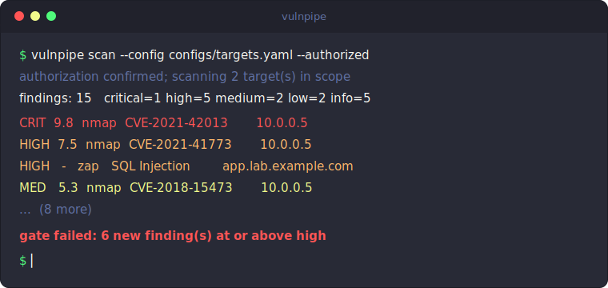
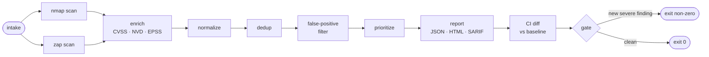

# vulnpipe

[](https://github.com/connor-p-mccune/vulnpipe/actions/workflows/ci.yml)
[](https://github.com/connor-p-mccune/vulnpipe/actions/workflows/ci.yml)
[](pyproject.toml)
[](LICENSE)
[](https://github.com/psf/black)
[](https://github.com/astral-sh/ruff)
[](https://mypy-lang.org/)

<p align="center">
  
</p>

> Modular network + web vulnerability scanning pipeline. It orchestrates
> [Nmap](https://nmap.org/) (network layer) and [OWASP ZAP](https://www.zaproxy.org/)
> (web layer), normalizes every result into one schema, enriches it with
> CVSS/CVE/EPSS, filters false positives, and emits prioritized **HTML / JSON /
> SARIF** reports with a CI gate.

**Detection and reporting only.** vulnpipe wraps existing scanners and reports
their findings for remediation. It contains no exploit code and emits no attack
payloads.

> [!WARNING]
> **Authorization notice — scan only systems you own or are explicitly permitted
> to test.** Active scanning is intrusive and, run against systems you are not
> authorized to test, is very likely illegal. vulnpipe enforces this: every scan
> requires the `--authorized` acknowledgement *and* a scope allowlist, and any
> target outside that scope is a hard error — nothing out of scope is ever
> scanned. See [`SECURITY.md`](SECURITY.md).

## Contents

- [See it in action](#see-it-in-action)
- [What it is](#what-it-is)
- [How it works](#how-it-works)
- [Requirements](#requirements)
- [Install](#install)
- [Quickstart](#quickstart)
- [Configuration](#configuration)
- [Run a scan](#run-a-scan)
- [Reports](#reports)
- [Serve the report (dashboard & API)](#serve-the-report-dashboard--api)
- [Remediation plan](#remediation-plan)
- [CI usage: baseline, diff, gate](#ci-usage-baseline-diff-gate)
- [Run via Docker](#run-via-docker)
- [CLI reference](#cli-reference)
- [Development](#development)
- [License](#license)

## See it in action

- 📊 **[Live sample report](https://connor-p-mccune.github.io/vulnpipe/)** — real
  vulnpipe HTML output rendered in your browser, no install required.
- 🧪 **[Lab case study](docs/case-study.md)** — scanning OWASP Juice Shop end-to-end
  in a self-contained Docker lab, from `docker compose up` to a prioritized report.
- 🧠 **[Design decisions](docs/DECISIONS.md)** — the architecture trade-offs (stable
  fingerprints, immutable findings, pure transforms, bounded concurrency) behind it.

> Prefer a terminal demo? Generate one locally with
> [`vhs`](https://github.com/charmbracelet/vhs): `vhs assets/demo.tape` → `assets/demo.gif`.

## What it is

Point vulnpipe at an authorized, in-scope range and it will:

- **discover** the network surface with Nmap — open ports, services, product and
  version detection, OS guesses, and CVE-tagged findings from the `vulners` / `vuln`
  NSE scripts;
- **scan** the web services it finds (or URLs you declare) with a running OWASP ZAP
  daemon — spider + active scan, with optional authenticated sessions;
- **check** those same web targets with [Nuclei](https://github.com/projectdiscovery/nuclei)
  (optional) — template-based CVE / misconfiguration / exposure detection that
  complements ZAP;
- **normalize** everything into a single `Finding` model with a stable fingerprint;
- **enrich** findings with CVSS scores/vectors (NVD), EPSS exploit-probability, and
  CISA **KEV** (known-exploited-in-the-wild) status — cached on disk, and never
  fabricated (a failed lookup leaves the field unknown);
- **filter** false positives via an allowlist plus a confidence threshold;
- **prioritize** by severity → known-exploited (KEV) → CVSS → EPSS → asset criticality;
- **plan** remediation — collapse the findings into a ranked, deduplicated worklist
  (patch this service, upgrade that dependency) ordered by the risk each fix removes;
- **map** findings onto the **OWASP Top 10** and the **CWE Top 25** (curated
  official mappings; unmapped findings stay unmapped, never forced into a category);
- **report** to JSON (canonical), HTML (human), SARIF (the GitHub Security tab), and
  a **GitLab** security report (the GitLab Vulnerability Report);
- **gate** CI by diffing against a baseline and failing only on *new* severe findings —
  or against a reviewable **policy-as-code** YAML (severity budgets, KEV block,
  risk threshold).

Beyond active scanning, `vulnpipe sbom` performs **passive supply-chain analysis**:
point it at a CycloneDX SBOM and it queries the [OSV.dev](https://osv.dev/) advisory
database for known-vulnerable components, emitting the same findings JSON the rest
of the toolchain consumes — no scope or authorization needed, because nothing is
probed.

## How it works

Stages run in order; each scanner returns `list[Finding]`, and everything
downstream operates on that one model.



```
vulnpipe/
├── core/         models.py, config.py, orchestrator.py, standards.py, logging.py
├── scanners/     base.py, nmap_scanner.py, zap_scanner.py, nuclei_scanner.py, registry.py
├── enrichment/   cvss.py, nvd_client.py, epss_client.py, kev_client.py
├── processing/   normalizer.py, deduplicator.py, false_positive.py, prioritizer.py
├── reporting/    json/html/markdown/csv/prometheus/sarif/gitlab/vex reporters, remediation.py, badge.py, templates/
├── ci/           baseline.py, differ.py, gate.py, policy.py, junit.py, trends.py
├── sbom/         cyclonedx.py, osv_client.py, analyzer.py, pipeline.py
├── ingest/       trivy.py, grype.py   (import third-party scanner reports)
├── auth/         auth_contexts.py
└── cli/          main.py
```

The full design — module responsibilities, the finding lifecycle, fingerprinting,
and the diff/gate model — is in [`docs/ARCHITECTURE.md`](docs/ARCHITECTURE.md).

## Requirements

- **Python 3.12+**
- The **`nmap`** binary on `PATH` (for the network layer)
- A running **OWASP ZAP daemon** (for the web layer) — easiest via the bundled
  [Docker stack](#run-via-docker)
- Optional: the **`nuclei`** binary on `PATH` (enables the template-based detection
  layer; off unless `nuclei.enabled` is set)
- Optional: an **NVD API key** (raises enrichment rate limits)

The network and web layers are independent: with no ZAP daemon you still get the
Nmap layer (and vice versa). A scanner that cannot run degrades to a logged warning
and an empty result rather than crashing the pipeline.

## Install

vulnpipe installs from source and exposes a `vulnpipe` console script.

```bash
git clone https://github.com/connor-p-mccune/vulnpipe.git
cd vulnpipe

python -m venv .venv
source .venv/bin/activate          # Windows: .venv\Scripts\activate

pip install .                      # runtime install
# or, for development (tests + linters + type checker):
pip install -e ".[dev]"
```

Verify it:

```console
$ vulnpipe version
vulnpipe 1.1.0
```

## Quickstart

**Try it in 60 seconds — no scanners, no services.** Render the bundled sample
report (real fixture-derived findings) to a self-contained HTML file:

```bash
pip install -e .
vulnpipe report --input examples/sample-report.json --format html > report.html
# open report.html in a browser — or see the live version linked above
```

**Run a real scan** (needs the `nmap` binary and/or a ZAP daemon — see [Requirements](#requirements)):

```bash
# 1. Create your scope/targets file (gitignored) from the example and edit it.
cp configs/targets.example.yaml configs/targets.yaml

# 2. Put secrets in the environment (never in the config file).
cp .env.example .env               # then edit, and: source .env

# 3. Run an authorized scan; write JSON + HTML + SARIF into ./results.
vulnpipe scan \
  --config configs/targets.yaml \
  --authorized \
  --output results \
  --html results/report.html \
  --sarif results/vulnpipe.sarif
```

`scan` refuses to start without `--authorized` and a non-empty scope allowlist, and
refuses any target outside that scope.

## Configuration

vulnpipe reads a single YAML **targets/scope file**. Copy the annotated example and
edit it:

```bash
cp configs/targets.example.yaml configs/targets.yaml   # gitignored
```

- [`configs/targets.example.yaml`](configs/targets.example.yaml) — the scope, the
  targets, optional per-target authentication, and all scanner/pipeline settings
  (every setting is optional and shown with its default).
- [`configs/default.yaml`](configs/default.yaml) — documents the scanner/pipeline
  **defaults** only (it deliberately omits `scope` and `targets`, which are
  required and live in your targets file).
- [`configs/false_positives.example.yaml`](configs/false_positives.example.yaml) —
  an optional allowlist that suppresses known-benign findings and sets a minimum
  confidence threshold; pass it with `--false-positives`. Every entry accepts an
  optional `reason` (the audit trail lives with the rule) and `expires` date, so a
  suppression is a **time-boxed risk acceptance**: when it lapses, the finding
  resurfaces in reports and the gate, and the scan warns about the expired entry —
  acceptances get revisited instead of becoming silently permanent.

### Scope (the authorization allowlist)

Nothing outside `scope` is ever scanned.

```yaml
scope:
  hosts:
    - "10.0.0.0/24"           # IPs and CIDRs (network scope)
    - "*.lab.example.com"     # wildcard hostname (also matches lab.example.com)
  urls:
    - "https://app.lab.example.com"   # full http(s) URL prefixes (web scope)
```

### Targets

Each target is a network host/CIDR (handed to Nmap), one or more web URLs (handed
to ZAP), or both. Every target must fall inside `scope`.

```yaml
targets:
  - name: internal-net
    host: "10.0.0.0/24"           # network-only

  - name: web-app
    host: "10.0.0.10"
    urls:
      - "https://app.lab.example.com"
```

### Authenticated scanning (optional, recommended)

Authenticated scans are the biggest false-positive reducer — without a session ZAP
reports spurious 401/redirect findings. A target may carry an `auth` block;
**credentials are referenced by environment-variable name and resolved at scan time,
never stored inline.** Three schemes are supported (`form`, `header`/JWT bearer, and
`script`):

```yaml
  - name: web-app
    host: "10.0.0.10"
    urls: ["https://app.lab.example.com"]
    auth:
      type: form
      login_url: "https://app.lab.example.com/login"
      username_field: "email"
      password_field: "password"
      username_env: "APP_USERNAME"   # value read from $APP_USERNAME at scan time
      password_env: "APP_PASSWORD"
      logged_in_indicator: "Log out"
```

### Secrets

Secrets never live in the config file — only the *name* of the environment variable
does. Provide them via the environment or a gitignored `.env` (see
[`.env.example`](.env.example)):

| Variable | Purpose |
| --- | --- |
| `ZAP_API_KEY` | ZAP daemon API key (must match the daemon's configured key). |
| `ZAP_API_URL` | ZAP daemon base URL (default `http://localhost:8080`). |
| `NVD_API_KEY` | Optional NVD key; raises enrichment rate limits. |
| `APP_USERNAME` / `APP_PASSWORD` | Form/script authenticated-scan credentials. |
| `API_BEARER_TOKEN` | Bearer/JWT token for header-based authenticated scanning. |
| `VULNPIPE_WEBHOOK_URL` | Slack-compatible webhook URL for `vulnpipe notify` (a secret). |

### Scanner, pipeline, and prioritization settings

The targets file also accepts optional `nmap`, `zap`, `enrichment`, `run`, and
`prioritization` blocks (all with sane defaults — see the example). For example,
`prioritization` ranks findings on more business-critical assets higher:

```yaml
prioritization:
  default_criticality: medium     # one of: low, medium, high, critical
  assets:
    - host: "10.0.0.10"           # the web-app host is business-critical
      criticality: critical
```

## Run a scan

```bash
vulnpipe scan --config configs/targets.yaml --authorized
```

This runs the full pipeline and writes the canonical report to
`results/latest.json`. Add `--html`, `--markdown`, `--sarif`, `--vex`, and/or
`--junit` to also write those formats, `--baseline baseline.json` to diff and gate
against a baseline, and `--gate-severity` to set the gate threshold (default `high`).

A run logs a concise summary:

```text
[12:00:00] INFO   authorization confirmed; scanning 2 target(s) in scope
[12:00:42] INFO   nmap scan complete findings=11 partial=False targets=1
[12:01:55] INFO   zap scan complete failed=0 findings=6 targets=1
[12:01:56] INFO   wrote findings JSON: results/latest.json
[12:01:56] INFO   findings: 15 (critical=1, high=5, medium=2, low=2, informational=5)
[12:01:56] INFO   diff: new=15 persisting=0 resolved=0
[12:01:56] ERROR  gate failed: 6 new finding(s) at or above high
```

> On the **first** run there is no baseline, so every finding is "new" and the gate
> may fail by design. Establish a baseline (below) so CI gates only on *regressions*.

## Supply-chain (SBOM) analysis

`vulnpipe sbom` analyzes what your software is *built from*, with no scanners and
no target: it reads a **CycloneDX** SBOM (the JSON emitted by `syft`, `cdxgen`,
`pip-audit --format cyclonedx-json`, …), queries **OSV.dev** for the advisories
affecting each declared component, and emits standard vulnpipe findings — severity
from each advisory's own CVSS vector, remediation from its declared fixed
versions, plus EPSS/KEV enrichment and the composite risk score.

```bash
# Analyze an SBOM; print the canonical findings JSON and keep a copy in results/.
vulnpipe sbom --input sbom.json --output results

# Or render any report format directly.
vulnpipe sbom --input sbom.json --format markdown > supply-chain.md

# The output is ordinary findings JSON, so the whole toolchain applies:
vulnpipe stats    --input results/sbom.json
vulnpipe baseline --input results/sbom.json --output sbom-baseline.json
vulnpipe gate     --current results/sbom.json --baseline sbom-baseline.json --policy policy.yaml
```

Because SBOM analysis is passive — a local file plus a public advisory API — it
requires no scope file and no `--authorized` flag. Nothing is probed.

## Import third-party scanners

Already running [Trivy](https://trivy.dev/) or
[Grype](https://github.com/anchore/grype)? `vulnpipe convert` normalizes their JSON
into the same `Finding` model, so a container or SBOM scan you already have flows
through vulnpipe's prioritization, remediation planning, gating, SLAs, and reports:

```bash
trivy image -f json myapp:1.0 > trivy.json
vulnpipe convert --input trivy.json --from trivy --output results/trivy.json

# Then the whole toolchain applies to the imported findings:
vulnpipe remediate --input results/trivy.json
vulnpipe merge -i results/latest.json -i results/trivy.json -o results/all.json
```

It is passive (it reads a report file and maps it), so like SBOM analysis it needs
no scope or `--authorized`. Severity, CVSS, CVE/CWE ids, and the fix version come
straight from the source report; nothing is invented.

To fold imports directly into a `scan` (so a single run and one baseline cover native
scanners *and* imported reports), list them under `imports:` in the targets file:

```yaml
imports:
  - path: "reports/trivy.json"
    format: trivy
  - path: "reports/grype.json"
    format: grype
```

## Reports

vulnpipe renders every format from the same findings; all are **deterministic** for
fixed input (no embedded wall-clock timestamp), so report output and snapshot tests
are stable across runs. The one spec-mandated exception is the OpenVEX publication
timestamp — pin it with `SOURCE_DATE_EPOCH` for byte-identical CI output.

| Format | Use |
| --- | --- |
| **JSON** | The canonical, lossless artifact. `scan` writes `results/latest.json`; `report` / `diff` / `baseline` read it back. |
| **HTML** | The human-readable report: summary cards (known-exploited and CWE Top 25 counts), inline SVG severity chart, a ranked OWASP Top 10 bar chart (most-prevalent weakness class first), a per-host breakdown with expandable per-finding details (description, remediation, CVSS vector, references), and a client-side filterable + sortable findings table with risk-score, KEV, and OWASP columns. |
| **Markdown** | A pull-request / Slack–friendly summary: headline totals, severity and OWASP Top 10 tables, and a prioritized findings table with risk score, CVSS, EPSS, and a KEV marker. |
| **Remediation** | The ranked remediation plan as a Markdown worklist (`report --format remediation`, `scan --remediation`) — the same fix-these-first output the `remediate` command and the HTML panel show. |
| **CSV** | One row per finding for a spreadsheet or data-frame — columns mirror the JSON fields (plus fingerprint, risk score, and OWASP categories). |
| **Prometheus** | Text-exposition gauges (findings by severity/source, known-exploited count, peak risk) for the node_exporter textfile collector or a Pushgateway. |
| **SARIF** | SARIF 2.1.0 for the GitHub code-scanning / Security tab. |
| **GitLab** | A GitLab-compatible security report (`report --format gitlab`) for the GitLab Vulnerability Report and the merge-request security widget — a DAST-style export with stable ids, CVE/CWE identifiers, and the report-schema scan block. |
| **OpenVEX** | [OpenVEX](https://openvex.dev) 0.2.0 `affected` statements for every finding that cites a real CVE / OSV id, for exploitability-exchange tooling (`vexctl`, scanner VEX inputs, policy engines). |

Render any format from a findings JSON to stdout:

```bash
vulnpipe report --input results/latest.json --format html     > report.html
vulnpipe report --input results/latest.json --format markdown > report.md
vulnpipe report --input results/latest.json --format sarif    > vulnpipe.sarif
vulnpipe report --input results/latest.json --format vex      > vulnpipe.vex.json
```

The OpenVEX output stays honest by construction: only findings citing a real
vulnerability identifier produce statements (hygiene alerts emit nothing), only the
`affected` status is asserted — `not_affected` / `fixed` are human judgements the
pipeline does not fabricate — and a CVE in the CISA KEV catalog is flagged in
`status_notes`. Combined with the SBOM command this closes the supply-chain loop:
`vulnpipe sbom -i sbom.json -f vex` turns a component inventory into a
machine-readable exploitability document.

### Sample report

A ready-made sample (rendered from the project's test fixtures, so it contains only
synthetic lab data) lives in [`examples/`](examples/):

- [`examples/sample-report.html`](examples/sample-report.html) — open it in a browser
- [`examples/sample-report.json`](examples/sample-report.json) — the canonical JSON

It holds 15 findings across 4 hosts, in vulnpipe's prioritized order. Two are
**known-exploited** (in the CISA KEV catalog), so they lead their severity band even
when another finding scores higher on CVSS alone — and each carries a composite
`risk_score` (0–100):

```text
SEVERITY      RISK  KEV  CVSS  SOURCE  HOST                  TITLE
critical        98   ⚠   9.8  nmap    10.0.0.5              CVE-2021-42013
high            75   ⚠   7.5  nmap    10.0.0.5              CVE-2021-41773
high            54       7.7  nmap    10.0.0.6              CVE-2021-23017
high            52       7.5  nmap    10.0.0.5              CVE-2016-10009
high            56        –   zap     app.lab.example.com   SQL Injection
high            56        –   zap     app.lab.example.com   Cross Site Scripting (Reflected)
medium          37       5.3  nmap    10.0.0.5              CVE-2018-15473
medium          35        –   zap     app.lab.example.com   Vulnerable JS Library
low              –        –   zap     app.lab.example.com   Application Error Disclosure
…
```

The canonical JSON is an envelope of `schema_version`, tool identity, a summary, and
every finding with its fingerprint and computed risk score:

```jsonc
{
  "schema_version": "1.0",
  "tool": { "name": "vulnpipe", "version": "1.1.0" },
  "summary": {
    "total": 15,
    "hosts": 4,
    "by_severity": { "critical": 1, "high": 5, "medium": 2, "low": 2, "informational": 5 }
  },
  "findings": [
    {
      "source": "nmap",
      "host": "10.0.0.5",
      "title": "CVE-2021-42013",
      "severity": "critical",
      "port": 80,
      "plugin_id": "vulners",
      "cve_ids": ["CVE-2021-42013"],
      "cvss_score": 9.8,
      "kev": true,
      "fingerprint": "741786901e8421ee…",
      "risk_score": 98
    }
    // …
  ]
}
```

## Serve the report (dashboard & API)

Sometimes you want to *browse* a report, not just render it to a file. `vulnpipe
serve` exposes an existing findings JSON as a small local web service — no web
framework, just the Python standard library:

```bash
vulnpipe serve --input results/latest.json         # http://127.0.0.1:8000
```

| Route | Serves |
| --- | --- |
| `GET /` | The interactive HTML dashboard (the same report the `html` format renders). |
| `GET /api/findings` | The canonical findings JSON (the report envelope). |
| `GET /api/summary` | The dashboard summary payload (severity, OWASP, top risks, worst hosts). |
| `GET /api/remediation` | The ranked remediation plan — fix these first. |
| `GET /metrics` | Prometheus text-exposition metrics, ready to scrape. |
| `GET /healthz` | A JSON liveness / readiness probe. |

```console
$ curl -s http://127.0.0.1:8000/healthz
{ "status": "ok", "version": "1.1.0", "findings": 15 }
$ curl -s http://127.0.0.1:8000/api/summary | jq '.by_severity'
{ "critical": 1, "high": 5, "medium": 2, "low": 2, "informational": 5 }
```

It is **read-only** by design — it renders an existing report and never scans,
mutates state, or reads a request body — so, like `report` and `stats`, it needs no
scope or `--authorized`. Mutating verbs get a `405`, and it binds loopback
(`127.0.0.1`) by default; pass `--host 0.0.0.0` to publish it on the network (a
non-loopback bind is warned about, since it exposes the report to anything that can
reach the address). Point a scrape config at `/metrics` or a uptime probe at
`/healthz` and a scan report becomes a live, queryable surface.

## Remediation plan

A findings list says *what* is wrong; `vulnpipe remediate` says *what to fix first*.
It collapses findings onto the action that resolves them — one patch clears several
CVEs on a service, one upgrade clears a dependency's advisories, one fix clears a
weakness class across endpoints — and ranks those actions by the risk each removes:

```console
$ vulnpipe remediate --input results/latest.json
vulnpipe remediation plan — 10 actions resolving 15 finding(s)
  #   Risk   Worst      Fixes   KEV   Action
  1    173   critical       3    !    Patch Apache httpd 2.4.49 on 10.0.0.5
  2     89   high           3         Patch OpenSSH 7.4 on 10.0.0.5
  3     56   high           1         Remediate: SQL Injection
  …
```

The recommendation reuses the scanner's own fix text when it offered one and never
invents a version otherwise. It reads the canonical findings JSON, so it composes
with `scan`, `sbom`, and `merge`; `--format markdown` drops a worklist into a pull
request and `--format json` feeds automation. The HTML report shows the same plan
as a panel under the summary.

## CI usage: baseline, diff, gate

vulnpipe turns findings into a build verdict by comparing the current scan against a
stored **baseline** of accepted findings (matched by fingerprint):

- **new** — in the scan but not the baseline;
- **persisting** — in both (baselined, so exempt from the gate);
- **resolved** — in the baseline but gone from the scan.

The **gate** fails the build only when a *new* finding meets or exceeds the
configured severity (default `high`) — or, with `--gate-risk-score N`, a composite
risk score of at least `N` — so existing accepted issues don't break CI, only
regressions do. Risk-score gating lets an actively-exploited (KEV) Medium fail the
build even though it sits below the severity bar.

```bash
# Establish a baseline from an accepted scan.
vulnpipe baseline --input results/latest.json --output baseline.json

# Later, diff a new scan against it.
vulnpipe diff --baseline baseline.json --current results/latest.json
```

```console
$ vulnpipe diff --baseline baseline.json --current results/latest.json
new:        2
persisting: 12
resolved:   1
  + [critical] CVE-2021-42013 (10.0.0.5)
  + [high] SQL Injection (app.lab.example.com)
  - [low] Application Error Disclosure (app.lab.example.com)
```

Run the gate inside `scan` by passing the baseline; it exits non-zero when a new
finding trips the threshold (use `--no-gate` to report without failing):

```bash
vulnpipe scan -c configs/targets.yaml --authorized \
  --baseline baseline.json --gate-severity high \
  --sarif results/vulnpipe.sarif --junit results/junit.xml
```

### Policy-as-code

A single severity threshold can't say *"no new criticals, at most five new
mediums, and never a new known-exploited finding."* A **gate policy** can — as a
reviewable YAML file
([`configs/policy.example.yaml`](configs/policy.example.yaml)):

```yaml
max_new:            # per-severity budgets for NEW findings
  critical: 0
  high: 0
  medium: 5
max_new_total: 20   # cap on new findings of any severity
min_risk_score: 90  # fail on any new finding with composite risk >= 90
block_kev: true     # refuse any new known-exploited (KEV) finding
```

Pass it to `scan --policy policy.yaml` (it decides the verdict instead of
`--gate-severity`), or re-evaluate an existing report without rescanning:

```console
$ vulnpipe gate --current results/latest.json --baseline baseline.json --policy policy.yaml
gate failed: 1 policy violation(s), 1 finding(s) (new critical <= 0; new high <= 0; new medium <= 5; new total <= 20; risk < 90; no new known-exploited)
  x 1 new critical finding(s) exceed the budget of 0
      [critical] CVE-2021-42013 (10.0.0.5)
$ echo $?
1
```

Only **new** findings are judged — persisting (baselined) findings never violate a
policy. `--format json` emits the verdict for automation.

A ready-to-adapt GitHub Actions workflow lives at
[`.github/workflows/security-scan.yml`](.github/workflows/security-scan.yml): it
runs an authorized scan, uploads the SARIF to code scanning, publishes the JUnit
gate report, and carries the baseline forward across runs via the Actions cache.

### Remediation SLAs

The gate stops *new* risk from landing; a **remediation SLA** stops *accepted* risk
from lingering. Record when each finding was first seen (`baseline --track-age`),
then check ages against per-severity deadlines:

```bash
# Stamp first-seen dates when you accept a scan into the baseline.
vulnpipe baseline --input results/latest.json --output baseline.json --track-age

# Later, fail the build if anything has aged past its remediation deadline.
vulnpipe sla --current results/latest.json --baseline baseline.json \
  --critical-days 7 --high-days 30            # or --policy configs/sla.yaml
```

```console
$ vulnpipe sla --current results/latest.json --baseline baseline.json --critical-days 7
vulnpipe SLA report — critical <= 7d
SLA breached: 1 finding(s) past their remediation deadline (3 tracked, 2 untracked)
  ! [critical] CVE-2021-42013 (10.0.0.5) — 21d old, SLA 7d (14d over, first seen 2026-06-13)
$ echo $?
1
```

Age is measured from the baseline's first-seen date against `--as-of` (default
today, pin it for reproducible CI). A finding with no recorded first-seen date is
*untracked* and never breaches — unknown age is never a violation.

### Use as a GitHub Action

vulnpipe also ships a reusable composite action ([`action.yml`](action.yml)), so a
workflow can run a scan and gate the build in a few lines — it sets up Python,
installs vulnpipe, runs the scan, and fails the job on a new severe finding:

```yaml
- uses: connor-p-mccune/vulnpipe@v1
  with:
    config: configs/targets.yaml
    authorized: "true"          # you are authorized to scan every in-scope target
    gate-severity: high
    baseline: baseline.json      # optional: gate only on regressions
    sarif: results/vulnpipe.sarif
- uses: github/codeql-action/upload-sarif@v3
  if: always()
  with:
    sarif_file: results/vulnpipe.sarif
```

Inputs are passed through the environment inside the action, never interpolated into
the shell, so untrusted values can't inject commands. The action wraps the CLI, so
provision the `nmap` binary and/or a ZAP daemon in the job as your targets require.

## Run via Docker

The bundled compose stack brings up an OWASP ZAP daemon and the scanner on a shared
network and runs an authorized scan end to end — one command:

```bash
# 1. Create your in-scope targets file and provide secrets.
cp configs/targets.example.yaml configs/targets.yaml   # then edit
cp .env.example .env                                    # set ZAP_API_KEY, etc.

# 2. Bring up ZAP + the scanner and run the scan.
ZAP_API_KEY=changeme docker compose -f docker/docker-compose.yml up --build
```

The scanner reaches ZAP at `http://zap:8080` over the shared network (the example
config picks that up from `${ZAP_API_URL}`, which compose sets), and reports land in
the `vulnpipe-results` volume. The image is multi-stage and runs as an unprivileged
user; without `NET_RAW`, Nmap uses TCP connect scans. See the
[Docker packaging](docs/ARCHITECTURE.md#docker-packaging) notes for details.

## CLI reference

```text
vulnpipe [--verbose/-v] COMMAND [OPTIONS]
```

| Command | What it does |
| --- | --- |
| `scan` | Validate authorization/scope, run the pipeline, write reports, and gate. Requires `--config` and `--authorized`. |
| `sbom` | Analyze a CycloneDX SBOM against OSV.dev and emit standard findings — passive supply-chain analysis, no scope/authorization needed (`--input`, `--output`, `--format`, `--no-enrich`). |
| `convert` | Import a third-party scanner report (Trivy or Grype JSON) into vulnpipe findings, so the whole toolchain applies to it (`--input`, `--from trivy\|grype`, `--output`, `--format`). |
| `gate` | Re-evaluate the CI gate over an existing findings JSON without rescanning — policy file or severity/risk options (`--current`, `--baseline`, `--policy`, `--format text\|json`). |
| `sla` | Report findings open past their per-severity remediation SLA, by age from an age-tracked baseline (`--current`, `--baseline`, `--policy` or `--critical-days`/`--high-days`/…, `--as-of`). |
| `validate` | Dry-run a config: print what *would* be scanned (network/web targets, enrichment, required secrets) and flag any out-of-scope target — without scanning (`--config`). |
| `report` | Render a findings JSON into JSON / HTML / Markdown / CSV / Prometheus / SARIF / GitLab / OpenVEX on stdout (`--input`, `--format`). |
| `serve` | Serve a findings JSON as a local read-only dashboard + JSON API (`/`, `/api/*`, `/metrics`, `/healthz`) on `http://127.0.0.1:8000` (`--input`, `--host`, `--port`). |
| `remediate` | Group a findings JSON into a ranked, deduplicated remediation plan — fix these first — as text / JSON / Markdown (`--input`, `--format`, `--top`). |
| `merge` | Combine findings JSONs from separate runs (e.g. a network scan + an SBOM analysis) into one deduplicated, re-prioritized report (`--input` repeated, `--output`, `--format`). |
| `stats` | Summarize a findings JSON — severity breakdown, OWASP Top 10, top risks, and worst-affected hosts — as a terminal view or a JSON dashboard payload (`--input`, `--format text\|json`). |
| `badge` | Render a findings JSON into a shields-style SVG status badge (`--input`, `--output`, `--label`). |
| `notify` | Post a findings summary to a Slack-compatible webhook (URL resolved from the environment via `--webhook-url-env`). |
| `trend` | Analyze how findings evolve across a chronological series of scan JSONs — totals, severity mix, and introduced/resolved deltas (text, JSON, or a self-contained HTML page with an inline SVG chart). |
| `diff` | Classify current findings against a baseline as new / persisting / resolved (`--baseline`, `--current`, `--format text\|json\|markdown\|html`). |
| `baseline` | Create or update a baseline from a findings JSON; `--track-age` stamps each new finding's first-seen date for SLA reporting (`--input`, `--output`, `--update`). |
| `schema` | Print the JSON Schema for the targets/scope config, the report envelope, a gate policy, an SLA policy, or the false-positive allowlist — for editor validation and autocomplete (`config` / `report` / `policy` / `sla` / `false-positives`). |
| `plugins` | List third-party scanner/reporter plugins discovered via entry points. |
| `version` | Print the vulnpipe version. |

Run `vulnpipe <command> --help` for the full option list.

## Extending with plugins

The scanner and reporter registries are open: an installed package can advertise
integrations under the `vulnpipe.scanners` and `vulnpipe.reporters` entry-point
groups and they are discovered at CLI startup — no fork, no changes to vulnpipe.

```toml
# pyproject.toml of your plugin package
[project.entry-points."vulnpipe.scanners"]
nikto = "vulnpipe_nikto.scanner:NiktoScanner"     # a BaseScanner subclass

[project.entry-points."vulnpipe.reporters"]
xlsx = "vulnpipe_xlsx.reporter:XlsxReporter"      # a BaseReporter subclass
```

Discovery is defensive: a broken plugin degrades to a logged warning (it can never
take down a scan), registration order is deterministic, and a plugin cannot shadow
a built-in name — built-ins always win, and the collision is warned about.
`vulnpipe plugins` shows what was loaded.

## Development

```bash
pip install -e ".[dev]"
pre-commit install
```

A change is "done" only when all four quality gates pass:

```bash
ruff check .          # lint
black --check .       # formatting
mypy vulnpipe         # type checking (strict)
pytest                # unit tests (no network, no real scanners)
pytest -m integration # integration tests (need real scanners)
```

See [`CONTRIBUTING.md`](CONTRIBUTING.md) for the conventions, testing rules, and how
to add a new scanner or reporter.

## License

Licensed under the [Apache License 2.0](LICENSE).
