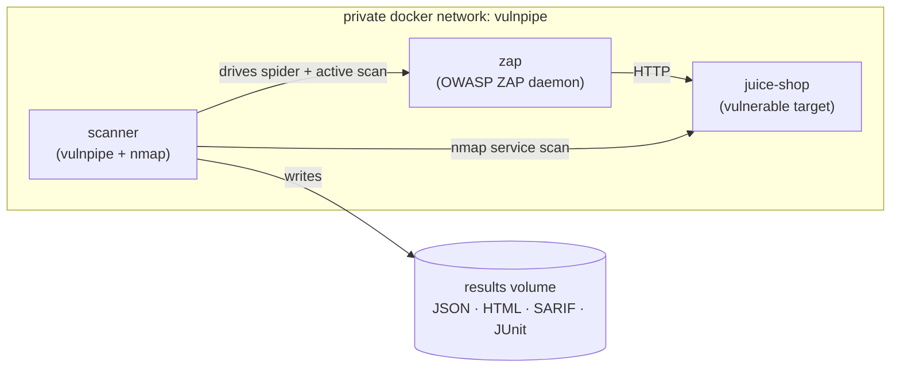

# Case study: scanning OWASP Juice Shop in a local lab

This walks through running vulnpipe end-to-end against a **self-hosted,
intentionally-vulnerable** web application — [OWASP Juice
Shop](https://owasp.org/www-project-juice-shop/) — and reading the report it
produces. It doubles as the reproducible verification of the Docker stack.

> **Authorized by construction.** The target runs in a container *you* start, on a
> private Docker network, and the run is scoped to that target only
> ([`configs/targets.lab.yaml`](../configs/targets.lab.yaml)). This is exactly the
> use case vulnpipe's scope/authorization rules exist for — never point this at a
> host you do not own.

## The lab



## Prerequisites

- Docker + Docker Compose
- A ZAP API key (any value; it just has to match the daemon): `export ZAP_API_KEY=changeme`
- Optional: `export NVD_API_KEY=...` to raise enrichment rate limits

## 1. Bring up the lab

```bash
ZAP_API_KEY=changeme docker compose \
  -f docker/docker-compose.yml \
  -f docker/docker-compose.lab.yml \
  up --build
```

This starts three services on a private network: the **juice-shop** target, the
**zap** daemon, and the **scanner**. The scanner's entrypoint waits for ZAP to be
ready, then runs:

```
vulnpipe scan --config configs/targets.lab.yaml --authorized \
  --html results/lab-report.html --sarif results/lab.sarif --junit results/lab-junit.xml
```

## 2. What vulnpipe does here

1. **nmap** scans the `juice-shop` host and reports the open HTTP service (port 3000).
2. **ZAP** spiders `http://juice-shop:3000`, runs an active scan, and returns its alerts.
3. The findings are **normalized**, **enriched** (CVSS/EPSS for any cited CVEs),
   **deduplicated**, **false-positive-filtered**, and **prioritized**.
4. Reports are written to the `vulnpipe-results` volume; the **gate** exits non-zero
   if a new finding meets the threshold (High by default; the first run has no
   baseline, so every finding is "new").

Copy the reports out of the volume to inspect them:

```bash
docker compose -f docker/docker-compose.yml -f docker/docker-compose.lab.yml \
  cp scanner:/app/results ./lab-results
open ./lab-results/lab-report.html        # macOS; use xdg-open / start elsewhere
```

> **Coverage tip.** Juice Shop is an Angular SPA, so ZAP's traditional spider crawls
> it shallowly. For a richer active scan, enable ZAP's **AJAX spider** or seed key
> URLs. Even with the basic spider, vulnpipe will surface the nmap service finding
> plus ZAP's passive/active alerts on the entry points it reaches.

## 3. Results

> _Fill this section in from your own run — paste the real summary, a few notable
> findings, and screenshots. Do not invent numbers; use exactly what the scan
> produced._

<!-- Replace the placeholders below with your actual run output. -->

**Run summary**

| Metric | Value |
| --- | --- |
| Total findings | _e.g. from the `findings: N (...)` log line_ |
| By severity | _critical / high / medium / low / informational_ |
| Gate verdict | _passed / failed and why_ |

**Notable findings** — _list a handful straight from `lab-results/latest.json`._

**Screenshots** — _add images to `docs/img/` and embed them:_

```markdown


```

The report format (which you'll see populated with real data) is previewable now in
[`examples/sample-report.html`](../examples/sample-report.html).

## Optional: upload SARIF to the GitHub Security tab

`lab.sarif` is valid SARIF 2.1.0. To see vulnpipe's findings render as code-scanning
alerts, upload it from a workflow run (see
[`.github/workflows/security-scan.yml`](../.github/workflows/security-scan.yml)) and
screenshot the **Security → Code scanning** view.

## Tear down

```bash
docker compose -f docker/docker-compose.yml -f docker/docker-compose.lab.yml down -v
```

## Reproducibility

For a repeatable lab, pin the images to digests after your first pull (record the
output of `docker images --digests`) — both `bkimminich/juice-shop` in
[`docker-compose.lab.yml`](../docker/docker-compose.lab.yml) and the ZAP image in
[`docker-compose.yml`](../docker/docker-compose.yml).

## Alternative target: DVWA (authenticated scanning)

[DVWA](https://github.com/digininja/DVWA) is server-rendered (so ZAP's spider
crawls it well) and login-gated — which lets you exercise vulnpipe's **authenticated
scanning** (Phase 6). Add a `dvwa` service to the overlay, then give the target an
`auth:` block (form login, credentials from `APP_USERNAME` / `APP_PASSWORD`) as shown
in [`configs/targets.example.yaml`](../configs/targets.example.yaml). The active scan
then runs as a logged-in user, which is the single biggest false-positive reducer.
